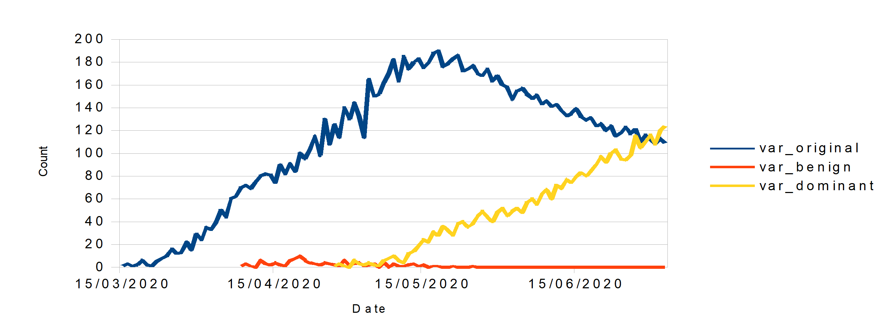

# Dominant Variant Finder

## Overview
Analyse Covid-19 sequencing datasets, looking for trends in variant composition. Identify those that look to be rapidly increasing in percentage contribution (potentially new dominant variant), allowing further invesigation and potentially containment actions to be advised. 

Using [CoVariants](https://covariants.org) Countries JSON datasource, created and maintained by Emma B. Hodcroft:
```
Emma B. Hodcroft. 2021. "CoVariants: SARS-CoV-2 Mutations and Variants of Interest." https://covariants.org/
```

## Version History
### v0.5
* Changed to CoVariants datasource, currently using a JSON snapshot, rather than 'live' data
* Data processing largely unchanged, however data already smoothed so no need to repeat
* Rapid trigger alert modified to require a threshold of 70 sequences to have been sequenced in that country - this reduces some false alarms, and matches rule applied on https://covariants.org/per-country
* Added option to output graphs and final report table (commented out)
* Improved graph appearance - legend now outside of line plot
* Example result data uploaded to [v_0_5_results](/v_0_5_results)
* For example, United Kingdom results:


```
United Kingdom
            Rapid Trigger At Threshold Met At  Alert Count
20E (EU1)         2020-08-17       2020-08-17            2
20I/501Y.V1       2020-11-09       2020-12-07            2
20A/S:439K        2020-08-17              NaT            1
```
* Trigger alert improvements still required - currently UK raises false alarm on 20A/S:439K for example

### v0.1.1
* Improved loop code - calling variant name more efficiently! Thx @bethsampher
### v0.1 - First release
* Proof of concept using 'imaginary data':

* Imports dataset csv file
* Determines percentage of daily cases related to each variant (column)
* Calculate 7-day change in percentage of cases related to variant
* Identify variants of interest by two possible definitions/triggers
* Reports variants of interest with date that trigger was met
* Currently outputs graphs of variant cases Vs time 


* Percentage contribution of variant Vs time


* 7day percentage change vs time


* Prints results:
```
             Rapid Trigger At Threshold Met At  Alert Count
var_dominant       2020-05-14       2020-05-27            2
var_original              NaT       2020-03-18            1
```

## Known Issues/Further work
### Known Issues
* Definitions/triggers have been arbitrarily assigned after visual analysis of 'imaginary' data - would benefit from expert input!
### Further Work
* Adjust definitions/triggers to values more suited to real data
* Import JSON 'live' data directly using "get(file_location).json()"
* Add looping to analyse all countries, create overall report too?
